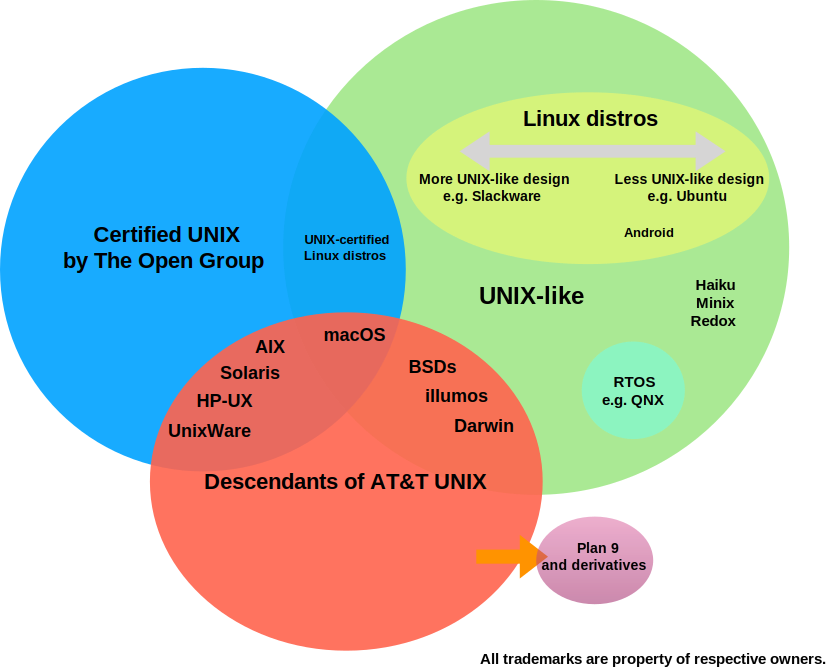

# Awesome UNIX®  

This list is an exploration of the world of UNIX®, including UNIX history, the relevance of UNIX today, and lists select awesome UNIX and UNIX-like projects. This list also contains resources for UNIX standards, programming, communities, and free software. *This project is not affiliated with, sponsored, or endorsed by The Open Group.*

## Contents

- [Frequently Asked Questions](#frequently-asked-questions)
	- [What is UNIX](#what-is-unix)
	- [Why is UNIX relevant today](#why-is-unix-relevant-today)
	- [Disambiguation: AT&T UNIX®, UNIX® Certification, UNIX®-Like, and Linux®](#disambiguation-att-unix-unix-certification-unix-like-and-linux)
	- [Commercial UNIX](#commercial-unix)
	- ["Unix Philosophy"](#unix-philosophy)
	- [AT&T UNIX®-Derived Descendants, e.g FreeBSD®](#att-unix-derived-descendants-eg-freebsd)
	- [Unix®-Like Operating Systems, e.g. Linux®](#unix-like-operating-systems-eg-linux)
- [*NIXes](#nixes)
	- [Certified UNIX Operating Systems](#certified-unix-operating-systems)
	- [AT&T UNIX®-Derived Operating Systems](#att-unix-derived-operating-systems)
	- [UNIX-Certified Linux-Based Operating Systems](#unix-certified-linux-based-operating-systems)
- [Linux](#linux)
	- [Most Unix®-Like Engineered Linux](#most-unix-like-engineered-linux-distributions-)
	- [Popular Commercial Linux® Distributions](#popular-commercial-linux-distributions-)
	- [Popular Non-Commercial Linux® Distributions](#popular-non-commercial-linux-distributions-)
	- [Mobile Linux® Distributions](#mobile-linux-distributions-)
	- [Unique Linux® Distributions/Related Projects](#unique-linux-distributionsrelated-projects)
	- [Embedded/IoT-Focused Linux® Distributions](#embeddediot-focused-linux-distributions)
- [iOS](#ios)
- [Solaris and Illumos®](#solaris-and-illumos)
- [GNU Hurd](#gnu-hurd)
- [More Unix®-Like Operating Systems](#more-unix-like-operating-systems)
- [Plan 9® Derivatives](#plan-9-derivatives)
- [Unix®-like Real Time Operating Systems](#unix-like-real-time-operating-systems)
- [Additional Resources](#additional-resources)
	- [UNIX® v. Unix/*NIX Disambiguation](#unix-v-unixnix-disambiguation)
	- [UNIX® History](#unix-history)
	- ["Unix Philosophy"](#unix-philosophy-1)
	- [Introductory UNIX® Skills](#introductory-unix-skills)
	- [Introductory Programming Skills](#introductory-programming-skills)
	- [UNIX® Code/Emulation](#unix-codeemulation)
	- [UNIX®/POSIX® Technical Standards](#unixposix-technical-standards)
	- [Community](#community)
	- [Free Software and Open Source Movements](#free-software-and-open-source-movements)
	- [UNIX®/Linux®-Related Trade Groups](#unixlinux-related-trade-groups)
	- [Notable Historic UNIX® and Unix®-like Operating Systems](#notable-historic-unix-and-unix-like-operating-systems)
	- [More macOS®](#more-macos)
	- [More illumos®](#more-illumos)
	- [More BSD](#more-bsd)
	- [More Linux®](#more-linux)
- [UNIX® and Unix®-Like Hardware Vendors](#unix-and-unix-like-hardware-vendors)
- [Intellectual Property Notices](#intellectual-property-notices)

## Frequently Asked Questions

### What is UNIX

[UNIX](https://en.wikipedia.org/wiki/History_of_Unix) is the greatest operating system family ever invented you have probably never heard about whose genius design ideas now enable everything great you love.

### Why is UNIX relevant today

The ideas behind UNIX®, a research operating system from AT&T in the 1960s, have evolved to form a set of core [computer science principles](https://en.wikipedia.org/wiki/Unix_philosophy) around which dozens of operating systems are built. These operating systems and applications built on them underpin most of modern computing, from the mobile devices in your pocket to mainframes that perform climate change analysis. They exist on a continuum that includes certified UNIX®, open source projects descended from the original AT&T UNIX®, and Unix-like projects designed to be Unix-compatible.

### Disambiguation: AT&T UNIX®, UNIX® Certification, UNIX®-Like, and Linux®

#### Commercial UNIX

UNIX® was originally a research operating system developed at AT&T's Bell Labs.® It has evolved today into a set of operating systems standards, called [POSIX](https://en.wikipedia.org/wiki/POSIX)® overseen by the IEEE®, and official certifications that can be obtained by companies for their commercial operating systems, through a process administrated by The Open Group®. Among the [operating systems certified as UNIX](https://www.opengroup.org/openbrand/register/) are massive mainframe operating systems like IBM®'s AIX® as well Apple®'s macOS® desktop operating for their MacBook® and iMac® lineup.

#### "Unix Philosophy"

"Unix philosophy" is a core set of computer science principles, first implemented in UNIX®, now codified in standards set forth by IEEE® and The Open Group®, and duplicated in dozens of UNIX®-like operating systems that emphasize building simple, short, clear, modular, and extensible software on a common set of programming standards and libraries that allow that software to be easily maintained and repurposed by developers other than its creators, across numerous operating systems and platforms. This enables the rapid spread and development of new and better software. It goes hand in hand with [open source philosophy](https://opensource.org/osd-annotated).

> "This is the Unix philosophy: Write programs that do one thing and do it well. Write programs to work together. Write programs to handle text streams, because that is a universal interface." - *Douglas McIlroy, former head of Bell Labs Computing Sciences Research Center*

#### AT&T UNIX®-Derived Descendants, e.g FreeBSD®

The term UNIX also debatedbly encompasses operating systems that are direct descendants of the original AT&T UNIX codebase but have since [re-implemented the AT&T code with code under open source licenses](https://en.wikipedia.org/wiki/Berkeley_Software_Distribution). The most prominent of which the family of BSDs: FreeBSD, OpenBSD, and NetBSD, and their derivatives. These are not UNIX® certified, they are technically Unix-like, but share a unique direct link back to AT&T UNIX®, while newcomers like Redox OS do not.

#### Unix®-Like Operating Systems, e.g. Linux®

For a variety of historical and legal reasons, there has also been a massive explosion of *Unix-like* operating systems. MINIX®, for example, was created as a Unix-like teaching operating system by Prof. Andrew S. Tanenbaum. Linux® was created because Linus Torvalds, a college student, [wanted to run a Unix-like operating system](https://www.cs.cmu.edu/~awb/linux.history.html) on his own hardware. Linux® has since gone on to become the most popular Unix-like operating system. Twenty years later, when Android, Inc.® needed a kernel for their new namesake mobile operating system they borrowed one from Linux. Unix-like operating systems implement some degree of the POSIX® standards and Unix philosophy but do not seek official UNIX® certification.

## *NIXes

## Certified UNIX Operating Systems

- [macOS®](https://www.apple.com/macos/) - macOS is the current series of Unix-based graphical operating systems developed and marketed by Apple Inc. designed to run on Apple's personal computers. 
- [AIX®](https://www.ibm.com/power/operating-systems/aix) - AIX is a series of proprietary Unix operating systems developed and sold by IBM for several of its computer platforms. 
- [HP-UX®](https://www.hpe.com/us/en/servers/hp-ux.html) - HP-UX is  Hewlett Packard Enterprise's proprietary implementation of the Unix operating system, based on UNIX System V.
- [UnixWare®](https://www.xinuos.com) - UnixWare is a Unix operating system made by Xinuos from the assets of SCO Group.
- [OpenServer®](https://www.xinuos.com/products/openserver-6/) - OpenServer is a Unix operating system made by Xinuos from the assets of SCO Group.
- [z/OS®](https://www.ibm.com/products/zos) - IBM z/OS is an operating system for IBM zSystems mainframes.

## AT&T UNIX®-Derived Operating Systems 

These operating systems, with the exception of Open Server 10, are not UNIX® certified by The Open Group.

- [OpenBSD](https://www.openbsd.org) - OpenBSD is a free and open-source Unix-like computer operating system descended from Berkeley Software Distribution (BSD), a Research Unix derivative developed at the University of California, Berkeley known for its security and development discipline.
	- [FuguIta](http://fuguita.org/?FuguIta) - FuguIta is an OpenBSD live CD featuring portable workplace, low hardware requirements, additional software, and partial support for Japanese. 
	- [MirBSD](http://www.mirbsd.org) - Fork of OpenBSD that tracks OpenBSD base with a number of enhancements and modifications.
- [NetBSD®](https://www.netbsd.org) - NetBSD is a free and open source Unix-like operating system that descends from Berkeley Software Distribution (BSD), a Research Unix derivative developed at the University of California, Berkeley known for its wideranging platform support. 
- [DragonflyBSD](https://www.dragonflybsd.org) - DragonFly BSD is a free and open source Unix-like operating system created as a fork of FreeBSD 4.8.
- [FreeBSD®](https://www.freebsd.org) - FreeBSD is a free and open-source Unix®-like operating system descended from Research Unix via the Berkeley Software Distribution (BSD) known for its software package availability and speed.
	- [GhostBSD](http://www.ghostbsd.org) - GhostBSD is a Unix®-like operating system based on TrueOS with [MATE](https://mate-desktop.org/) as its default desktop environment.
	- [MidnightBSD](https://www.midnightbsd.org) - MidnightBSD is a free Unix®-like, desktop-oriented operating system based on FreeBSD 6.1 that borrows heavily from the NeXTSTEP graphical user interface.
	- [HardendedBSD](https://hardenedbsd.org) - HardenedBSD is a security-enhanced fork of FreeBSD. The HardenedBSD Project implements a number of exploit mitigation and security technologies on top of FreeBSD.
	- [TrueNAS CORE®](https://www.truenas.com/truenas-core/) - TrueNAS CORE (formerly known as FreeNAS®) is a free and open-source network-attached storage (NAS) software based on FreeBSD and the OpenZFS file system.
	- [pfSense®](https://www.pfsense.org) - pfSense is an open source firewall/router computer software distribution based on FreeBSD.
    - [OPNsense®](https://opnsense.org) - OPNsense originally forked from pfSense in 2014 over technical differences between developers of pfSense.
	- [Open Server 10®](https://www.xinuos.com/menu-products/openserver-10) - Xinuos® OpenServer 10® commercial operating system based on FreeBSD 10 and designed to support business applications. 💰
	- [XigmaNAS](https://xigmanas.com/) - XigmaNAS (formerly known as NAS4Free) is an embedded Open Source NAS (Network-Attached Storage) distribution based on the latest FreeBSD releases.
	- [helloSystem](https://hellosystem.github.io/) - helloSystem is a FreeBSD-based desktop system for creators with a focus on simplicity, elegance, and usability. Its design follows the “Less, but better” philosophy. It is intended as a system for “mere mortals”, welcoming to switchers from the Mac. 

## UNIX-Certified Linux-Based Operating Systems

As of 2023, there are no more UNIX®-certified Linux-based operating systems. The last two being [K-UX](http://www.inspursystems.com/product/32-way-system/)® from Inspur and [EulerOS](http://developer.huawei.com/ict/en/site-euleros)® from Huawei.

Many Linux-based operating systems include a UNIX® compatability add-on that pass OpenGroup UNIX® compatability suite tests, but the Linux vendors no longer obtain UNIX® certification.

## Linux
The Most Popular *Unix-Like* Operating System. These operating systems are not UNIX® certified by The Open Group.

### Most Unix®-Like Engineered Linux [Distributions](https://en.wikipedia.org/wiki/Linux_distribution) 

- [Slackware](http://www.slackware.com) - Slackware is a Linux distribution created by Patrick Volkerding in 1993. Slackware aims for design stability and simplicity and to be the most "Unix-like" Linux distribution.
	- [Salix](https://www.salixos.org) - Salix is a Linux distribution based on Slackware that is simple, fast, and easy to use. Salix adds automated dependency resolution, a larger repository of applications, and a suite of native administration and configuration tools for both the GUI and the command line.
- [Devuan](https://devuan.org) - Devuan Linux is a fork of Debian without systemd from Unix veterans with the goal of becoming the new go-to base distribution for Linux. XFCE is default desktop environment.
	- [heads](https://heads.dyne.org/about.html) - Heads is a live CD to connect securely over Tor, unlike Tails it does not rely on systemd or non-free software. awesome is default desktop environment.
	- [Gnuinos](http://gnuinos.org/) - Gnuinos is a lightweight Linux libre distro based on Devuan with no non-free software featuring OpenBox desktop.
- [Gentoo®](https://www.gentoo.org) - Gentoo is a Linux distribution built using the Portage package management system. Unlike a binary software distribution, the source code is compiled locally at the time of installation. Gentoo is known for its speed.
	- [Funtoo](https://www.funtoo.org/Welcome) - Funtoo Linux is a Linux-based operating system that is a variant of Gentoo Linux.
	- [Redcore](https://redcorelinux.org) - Redcore Linux is a distribution based on Gentoo Linux that aims to be a very quick way to install a pure Gentoo Linux system without spending hours or days compiling from source code.
- [Alpine](https://alpinelinux.org) - Alpine Linux is an independent, non-commercial, general purpose Linux distribution designed for power users who appreciate security, simplicity and resource efficiency.
	- [Adélie](http://adelielinux.org/) - Adélie Linux was created by Gentoo users who combined the power of Alpine with the ease-of-use of a binary package manager. Adélie is notable for supporting x86, PowerPC, MIPS, and ARM platforms.
- [Void](https://voidlinux.org) - Void is a general purpose operating system, based on the monolithic Linux kernel, features XBPS packaging system.
- [GuixSD](https://www.gnu.org/software/guix/) - GuixSD is an advanced distribution of the GNU operating system developed by the GNU Project, home of gcc and the GPL, which respects the freedom of computer users.
- [Linux From Scratch](http://www.linuxfromscratch.org/lfs/) - Linux From Scratch is a way to install a working Linux system by building and installing all components manually, including the bootloader, kernel, and user programs. 
- [Dragora](https://www.dragora.org/) - The Dragora project produces a libre, reliable, Unix-like GNU/Linux distribution made from scratch.

## Popular Commercial Linux® Distributions 

- [Ubuntu®](https://ubuntu.com) - Ubuntu is a Debian-based Linux distribution published by Canonical® who offer commercial support for enterprise-class Ubuntu Server variant.
	- [Pop!_OS](https://system76.com/pop) - POP!_OS is a developer and maker-focused minimalist Linux distro from Linux hardware manufacturer System 76®. It runs on any x86-compatible hardware.
	- [elementaryOS](https://elementary.io) - Distro elementaryOS is a consumer-oriented Linux distribution based on Ubuntu. It is the flagship distribution to showcase the Pantheon desktop environment. 💰
- [Red Hat Enterprise®](https://www.redhat.com) - Red Hat Enterprise Linux is a Linux distribution developed by Red Hat® and targeted toward the commercial market. 💰
- [SUSE Linux Enterprise®](https://www.suse.com) - SUSE Linux Enterprise workstation/server is a Linux-based operating system developed by SUSE®. It is designed for servers, mainframes, and workstations. 💰
- [Oracle®](https://www.oracle.com/linux/) - Oracle Linux® is compiled from Red Hat Enterprise Linux source code, replacing Red Hat branding with Oracle's, optimized to run Oracle software. 💰
- [Deepin](https://www.deepin.org) - Deepin is a popular Chinese Linux distribution based on Debian with a focus on being a user-friendly desktop Linux distribution. It includes a number of pre-installed proprietary applications, such as Skype.
- [Clear Linux](https://clearlinux.org/) - Clear Linux is a distribution developed and maintained by Intel, the makers of Intel computer processors. The distribution is heavily optimized for Intel processors at the kernel and library levels. As a result is it one of the highest performing Linux distros on x86_64 hardware.

## Popular Non-Commercial Linux® Distributions 

- [Debian®](https://www.debian.org) - Debian is a Unix-like computer operating system that is composed entirely of free software, most of which is under the GNU General Public License and packaged by a group of individuals participating in the Debian Project.
- [Fedora®](https://getfedora.org) - Fedora is an Unix-like operating system based on the Linux kernel and GNU programs (a Linux distribution), developed by the community-supported Fedora Project and sponsored by the Red Hat company.
- [CentOS Stream](https://centos.org) - CentOS Stream is a Linux distribution that attempts to provide a free, enterprise-class, community-supported computing platform.
- [Mageia](https://www.mageia.org) - Mageia is a Linux based operating system, distributed as free and open source software. It is forked from the Mandriva Linux distribution.
- [OpenSUSE](https://www.opensuse.org) - openSUSE formerly SUSE Linux and SuSE Linux Professional, is a Linux-based project and distribution sponsored by SUSE Linux and other companies.
- [Arch](https://www.archlinux.org) - Arch Linux is a Linux distribution for computers based on x86-64 architectures.
	- [Manjaro](https://manjaro.org) - Manjaro Linux is an open source operating system for computers. It is a distribution of Linux based on the Arch Linux distribution.
	- [Parabola](https://www.parabola.nu) - Parabola is derived from Arch and provides packages from it that meet the Free Software Foundation guidelines and replacements for the packages that don't.
- [Solus](https://getsol.us) - Solus is an independent desktop operating system based on the Linux kernel. It is offered as a curated rolling release model. It is the flagship distro for the Budgie desktop environment and closely tracks optimizations found in Clear Linux, making it one of the fastest desktop Linux distros available.
- [Mint](https://linuxmint.com) - Linux Mint is a community-driven Linux distribution based on Debian and Ubuntu that strives to be a "modern, elegant and comfortable operating system which is both powerful and easy to use.

## Mobile Linux® Distributions 

- [Android™](https://source.android.com) - Android is a mobile operating system developed by Google®, based on the Linux kernel and designed primarily for touchscreen mobile devices such as smartphones and tablets.
- [Chrome OS™](https://en.wikipedia.org/wiki/Chrome_OS) - Chrome OS is an operating system designed by Google that is based on the Linux kernel and uses the Google Chrome™ web browser as its principal user interface.
- [CopperheadOS®](https://copperhead.co/android/) - CopperheadOS is a source-available operating system for smartphones and tablet computers, based on the Android mobile platform. It is based on the official releases of the Android Open Source Project by Google®, with added privacy and security features.💰
- [postmarketOS](https://postmarketos.org) - postmarketOS, is a free and open-source operating system under development primarily for smartphones, based on the lightweight Alpine Linux distribution.
- [Halium Project](https://halium.org) - Halium is the collaborative project to unify the Hardware Abstraction Layer for projects which run GNU/Linux on mobile devices with pre-installed Android.
- [LineageOS](https://lineageos.org) - LineageOS is a free and open-source operating system for smartphones and tablet computers, based on the Android mobile platform, forked from CyanogenMod.
- [Mer](http://merproject.org) - Mer is a free and open-source software distribution, targeted at hardware vendors to serve as a middleware for Linux kernel-based mobile-oriented operating systems. It is a fork of [MeeGo](https://en.wikipedia.org/wiki/MeeGo)™.
- [Sailfish OS](https://sailfishos.org) - Sailfish OS is a general purpose Linux used commonly as mobile operating system combining the Linux kernel, the open-source Mer core stack of middleware, a proprietary UI, and other third-party components.
- [Tizen™](https://www.tizen.org) - Tizen is an open source, standards-based software platform for multiple device categories, including smartphones, tablets, TVs, netbooks and automotive infotainment platforms.
- [WebOS](https://en.wikipedia.org/wiki/WebOS) - WebOS is a Linux kernel-based multitasking operating system for smart devices that has been was first used as a mobile operating system on Palm devices and introduced a number of UX/design metaphors later duplicated in iOS and Android. Initially developed by Palm, then acquired by HP, and now owned by Qualcomm, it is now commonly found on LG-brand smart TVs.
- [LuneOS](http://www.webos-ports.org/wiki/Main_Page) - LuneOS is a mobile operating system based on the Linux kernel and currently developed by WebOS Ports community. LuneOS is the open source successor for Palm/HP webOS where the user interface is rebuilt from scratch by using the latest technologies available and installs on any devices compatible with CyanogenMod.

## Unique Linux® Distributions/Related Projects 

- [Windows Linux Subsystem](https://msdn.microsoft.com/en-us/commandline/wsl/faq) - Windows® Subsystem for Linux (WSL) is a compatibility layer for running Linux binary executables natively on Windows 10. WSL currently supports Ubuntu, OpenSUSE Leap, SUSE Enterprise Linux, Debian, and Kali Linux. Official Fedora support is coming soon. Unofficial support for other distributions. 💰
- [QubesOS](https://www.qubes-os.org) - QubesOS is a security-focused desktop operating system that aims to provide security through isolation. Virtualization is performed by Xen®, and user environments can be based on Fedora, Debian, Whonix, and Microsoft Windows, among other operating systems .
- [Bedrock](https://bedrocklinux.org/) - Bedrock Linux is a Linux distribution that currently installs from an existing Linux installation, allowing the user to select a preferred init at boot time and install Linux packages from multiple distributions at the same time .
- [GoboLinux](https://www.gobolinux.org) - GoboLinux is an alternative Linux distribution which redefines the entire filesystem hierarchy. In GoboLinux you don't need a package database because the filesystem is the database . 
- [GNUSTEP](http://www.aiei.ch/gnustep/) - GNUSTEP is a Linux live CD distribution based on Debian that prominently features the [GNUstep](https://en.wikipedia.org/wiki/GNUstep) application frameworks, a free software re-implementation of the OPENSTEP and Cocoa frameworks originally developed by NeXT with Sun Microsystems.
- [oasis](https://github.com/michaelforney/oasis) - A small statically-linked linux system suitable for a range of uses including server and desktop. The entire system can be compiled in minutes .
- [Tails](https://tails.boum.org) - Tails is a security-focused Debian-based Linux distribution aimed at preserving privacy and anonymity  .
- [Red Star OS](https://en.wikipedia.org/wiki/Red_Star_OS) - Red Star OS is a North Korean Linux operating system developed for use in North Korea that computer researches have [noted](https://www.reuters.com/article/northkorea-computers/paranoid-north-koreas-computer-operating-system-mirrors-its-political-one-idUSKBN0UA0GF20151227) watermarks every document and media file on a computer or on any USB stick connected to it.
- [Kali Linux](https://www.kali.org/) - Kali Linux is a Debian-derived Linux distribution designed for digital forensics and penetration testing. It is maintained and funded by Offensive Security Ltd .
- [NixOS Linux](https://nixos.org/) - NixOS is a Linux distribution that built on the unique completely declarative Nix package manager .

## Embedded/IoT-Focused Linux® Distributions

- [OpenWrt](https://en.wikipedia.org/wiki/OpenWrt) - OpenWrt is an open source project for an embedded operating system based on Linux, primarily used on embedded devices to route network traffic.
- [Ångström](http://angstrom-distribution.org) - A Linux distribution for a variety of embedded devices. The distribution is the result of work by developers from the OpenZaurus, OpenEmbedded, and OpenSIMpad projects.
- [Poky](https://www.yoctoproject.org/tools-resources/projects/poky) - Poky is a reference distribution for the Yocto Project™, an open source project that provides templates, tools, and methods to create custom Linux-based systems for embedded devices.
- [Ubuntu Core](https://www.ubuntu.com/core) - Ubuntu Core is a tiny, transactional version of Ubuntu for IoT devices and large container deployments.
- [Raspberry Pi OS](https://www.raspberrypi.org/software/) - Raspberry Pi OS is a Debian-based computer operating system for Raspberry Pi.
- [Tiny Core Linux](https://en.wikipedia.org/wiki/Tiny_Core_Linux) - Tiny Core Linux (TCL) is a minimal Linux operating system focusing on providing a base system using BusyBox and FLTK, developed by Robert Shingledecker.

## Other Unix®-Like Operating Systems

These operating systems are not UNIX® certified by The Open Group.

## iOS

- [iOS®](https://www.apple.com/ios/) - iOS is a mobile operating system created and developed by Apple Inc. with a larged shared code base with macOS.
	- [watchOS®](https://www.apple.com/watchos/) - watchOS is the mobile operating system of the Apple Watch®, developed by Apple Inc. It is based on the iOS operating system.
	- [tvOS™](https://developer.apple.com/tvos/) - tvOS is an operating system developed by Apple Inc. for the fourth-generation and later Apple TV digital media player. It is based on the iOS operating system.

## Solaris and illumos 
Solaris® was originally a UNIX operating system developed jointly by Sun Microsystems® and AT&T® as a version of AT&T's UNIX System V Release 4. Sun continued development on Solaris and later obtained UNIX certification for Solaris. In 2004 Sun open-sourced much of the Solaris code base as OpenSolaris. Sun was acquired by Oracle in 2010 who discontinued formal support of the OpenSolaris project. OpenSolaris was forked and lives on as illumos.

- [Solaris®](https://www.oracle.com/solaris/solaris11/index.html) - Solaris is a Unix operating system originally developed by Sun Microsystems, acquired by Oracle in 2010.
- [illumos](https://wiki.illumos.org/display/illumos/illumos+Home) - Derived from OpenSolaris, illumos is a free and open-source Unix operating system, derived from SVR4 UNIX and BSD.
	- [OpenIndiana](https://www.openindiana.org) - OpenIndiana is a free and open-source, Unix operating system derived from OpenSolaris and based on illumos. Developers forked OpenSolaris after Oracle Corporation discontinued it.
	- [SmartOS](https://www.joyent.com/smartos) - SmartOS is a free and open-source SVR4 hypervisor, based on the illumos operating system that combines OpenSolaris technology with Linux's KVM virtualization.
	- [OmniOS](https://omniosce.org) - OmniOS builds on illumos to make a complete operating system and provide users with a familiar, installable operating system with a minimal package set to ease regulatory compliance.
	- [DilOS](http://www.dilos.org) - DilOS is an illumos-based platform featuring the Debian package manager (dpkg+apt).
	- [Tribblix](http://tribblix.org) - Tribblix is an operating system created by Peter Tribble. Derived from OpenSolaris, OpenIndiana, and illumos, it blends a retro style with modern components.
	- [XStreamOS](http://www.sonicle.com/index.jsp?pagename=xstreamos&parent=products) - XStreamOS is an  effort to mantain a distribution of the illumos kernel, featuring a customized text install, the ZFS fileystem, advanced features, and a starting point to contribute and develop the illumos kernel.
	- [v9os](http://milax.fi/v9os.html) - Server-only, IPS-based minimal SPARC-only distribution of illumos.

## GNU Hurd

- [GNU/Hurd](https://www.gnu.org/software/hurd/hurd.html) - GNU Hurd is a multiserver microkernel developed by the GNU Project. It has been under development since 1990 and is designed as a replacement for the Unix kernel. It is released as free software under the GNU General Public License .
	- [Debian GNU/Hurd](https://www.debian.org/ports/hurd/) - Debian GNU/Hurd is an implementation of the GNU Hurd on the Debian userspace with the apt package manager.
	- [Arch GNU/Hurd](https://archhurd.org/about/) - Arch GNU/Hurd is an implementation of the GNU Hurd on the Arch userspace with the pacman package manager.

## More Unix-Like Operating Systems

- [Minix®](http://www.minix3.org) - Minix® is a POSIX®-compliant Unix-like computer operating system based on a microkernel architecture. In 2017 it was learned that Intel™ used a version of MINIX on many of its x86-series processors, perhaps making it the most popular Unix-like operating system .
- [Haiku](https://www.haiku-os.org) - Haiku is a free and open-source operating system compatible with the now-discontinued BeOS.® Its development began in 2001, and the operating system became self-hosting in 2008 .
- [PureDarwin](http://www.puredarwin.org) - PureDarwin is a operating system based on the open-source components of Apple's macOS operating system, principally code derived from NeXTSTEP, BSD, Mach, and other software projects released under free software licenses.
- [Minoca OS](https://github.com/minoca/os) - Minoca OS is a general purpose operating system written from scratch. It aims to be lean, maintainable, modular, and compatible with existing software.
- [Redox](https://www.redox-os.org) - Redox is a Unix-like microkernel operating system written in the programming language Rust, a language with focus on safety and high performance. Redox aims to be secure, usable, and free .
- [Akaros](https://github.com/brho/akaros) - Akaros is an open source, GPL-licensed operating system for manycore architectures. The goal is to provide support for parallel and high-performance applications and to scale to a large number of cores .
- [Sortix](https://sortix.org) - Sortix is a small self-hosting operating-system aiming to be a clean and modern POSIX implementation, a hobbyist operating system written from scratch with its own base system, including kernel and standard library, as well as ports of third party software.
- [ToaruOS](https://github.com/klange/toaruos) - ToaruOS is a hobbyist, educational, Unix-like operating system built entirely from scratch. It includes a kernel, bootloader, dynamic linker, C standard library, composited windowing system, and several utilities and applications .
- [FiwixOS](https://www.fiwix.org) - FiwixOS is a UNIX-like operating system that includes the Fiwix kernel,  GNU Toolchain, libraries and additional software. It uses  [Newlib](https://sourceware.org/newlib/) as its C  library and all the included software is free and open-source software. The Fiwix kernel is written from scratch and aims for Linux 2.0 system call compatiblility.

## Plan 9 Derivatives

Plan 9® was developed by Bell Labs as the successor to UNIX and incorporated novel ideas, such as a GUI and [distributed computing](https://en.wikipedia.org/wiki/Distributed_operating_system). Official development by Bell Labs has since halted but the code was re-released under the GPL and projects exist to build on Plan 9. Many Bell Labs employees still volunteer on these projects.

- [9front](http://9front.org) - 9front is a fork of Plan 9 from Bell Labs by the People's Front of Cat-V. It is a next generation mushroom cloud computing platform for the 20th century .
- [9legacy](http://9legacy.org) - 9legacy is an experimental patch queue for Plan 9 from Bell Labs .
- [Harvey OS](https://harvey-os.org) - Harvey is an effort to provide a modern, distributed, 64 bit operating system. A different environment for researching and finding new lines of work. It can be built with gcc and clang and has an ANSI/POSIX compliant subsystem.
- [Inferno®](http://www.vitanuova.com/inferno/) - Inferno was an effort to commercialize Plan 9 as networking software. However, like Plan 9, it remained obscure while its ideas permeated into current operating systems. 
- [Jehanne](http://jehanne.h--k.it/) - Jehanne is a new distributed operating system designed for programmers. The core values that lead the development are simplicity and security. Jehanne is a fork of Harvey.

## Unix-like Real Time Operating Systems

A [real-time operating system](https://en.wikipedia.org/wiki/Real-time_operating_system) is an operating system intended to serve real-time applications that process data as it comes in, typically without buffer delays. An example of this in QNX which is used widely in cars and aircraft.

- [QNX®](https://blackberry.qnx.com/en) - QNX is a commercial Unix-like real-time operating system, aimed primarily at the embedded systems market, found in many modern automobiles. 💰
- [Integrity®](https://www.ghs.com/products/rtos/integrity.html) - Integrity is a real-time operating systems produced and marketed by Green Hills Software. Integrity-178B has a top National Security Agency rating. 💰
- [LynxOS®](http://www.lynx.com/products/real-time-operating-systems/lynxos-rtos/) - The LynxOS RTOS is a Unix-like real-time operating system from Lynx Software Technologies. LynxOS features full POSIX conformance and, more recently, Linux compatibility. 💰
- [nuttX®](http://nuttx.org) - NuttX is a real-time operating system (RTOS) with an emphasis on standards compliance and small footprint. Scalable, the primary focus in NuttX are POSIX and ANSI standards.
- [Fuchsia](https://github.com/fuchsia-mirror?utf8=✓&query=Escher) - Fuchsia is a new real-time operating system (RTOS) [currently being developed](https://lwn.net/Articles/718267/) by Google with a degree of POSIX compataibility.

## Additional Resources

### More UNIX®

#### UNIX® v. Unix/*NIX Disambiguation

- [Differentiating UNIX and Linux](https://www.ibm.com/developerworks/aix/library/au-unix-difflinux.html) - From IBM.
- [What, a real UNIX®?](https://www.freebsd.org/doc/en_US.ISO8859-1/articles/explaining-bsd/what-a-real-unix.html) - Excerpt from [Explaining BSD](https://www.freebsd.org/doc/en_US.ISO8859-1/articles/explaining-bsd/index.html).
- [10 differences between Linux and BSD](https://www.techrepublic.com/blog/10-things/10-differences-between-linux-and-bsd/) - From Tech Republic 📰.
- [All About Linux 2008: Aren't UNIX and Linux the same thing? Yes and no.](https://techcrunch.com/2008/03/24/arent-unix-and-linux-the-same-thing-yes-and-no/) - From Techcrunch 📰.
	
#### UNIX History

- [Unix Heritage Wiki](http://wiki.tuhs.org/doku.php?id=start) - The Unix Heritage Wiki aims to collect the available historical documents of Unix into one central place so they can be studied by researchers and Unix enthusiasts alike.
- [Unix History](https://www.levenez.com/unix/) - A simplified diagram by Éric Lévénez of UNIX history and several useful other UNIX historical resources.
- [Unix and Multics](http://www.multicians.org/unix.html) - The Multicians web site presents the story of the Multics operating system for people interested in the system's history.
- [The Evolution of the Unix Time-sharing System](https://www.bell-labs.com/usr/dmr/www/hist.html) - Paper presents a brief history of the early development of the Unix operating system, by Dennis M. Ritchie.
- [Twenty Years of Berkeley Unix: From AT&T-Owned to Freely Redistributable](http://www.oreilly.com/openbook/opensources/book/kirkmck.html) - A history of BSD, from the original UNIX through the litigation and 4.4BSD. An excerpt from "Open Sources: Voices from the Open Source Revolution", O'Reilly Media, 1st edition (January 1999), ISBN 1565925823. 📚
- [A Quarter Century of Unix](http://wiki.tuhs.org/doku.php?id=publications:quarter_century_of_unix) - Peter Salus, Addison-Wesley Professional, June 10, 1994, ISBN 978-0201547771. 📚
- [The C Programming Language](https://ia801303.us.archive.org/1/items/TheCProgrammingLanguageFirstEdition/The%20C%20Programming%20Language%20First%20Edition%20%5BUA-07%5D.pdf) - Brian Kernighan and Dennis Ritchie, Bell Telephone Laboratories, 1978, ISBN 0131101633. 📚
- [AT&T Archives: The UNIX Operating System](https://www.youtube.com/watch?v=tc4ROCJYbm0) 📼
- [UNIX](https://archive.org/details/UNIX1985) - From "Computer Chronicles" TV Series (1985). 📼
- [UNIX](https://archive.org/details/unix_2) - From "Computer Chronicles" TV Series (1989). 📼
- [C and Unix at Bell Labs](https://www.youtube.com/watch?v=TUWt_StXKsY) - By Brian Kernighan at Vintage Computer Federation East 10 (2016). 📼
- [A Repository of Unix History and Evolution](https://www.spinellis.gr/pubs/jrnl/2016-EMPSE-unix-history/html/unix-history.html) - The history and evolution of the Unix operating system from 1972 to 2016 by Diomidis Spinellis [PDF](http://www.spinellis.gr/pubs/jrnl/2016-EMPSE-unix-history/html/unix-history.pdf).
- [Unix Architecture Evolution from the 1970 PDP-7 to the 2018 FreeBSD Important Milestones and Lessons Learned](https://www.youtube.com/watch?v=FbDebSinSQo) - Diomidis Spinellis at Fosdem 2018. 📼
- [The Strange Birth and Long Life of Unix](https://spectrum.ieee.org/tech-history/cyberspace/the-strange-birth-and-long-life-of-unix) - By Warren Toomey.

#### "Unix Philosophy"

- [The Art of Unix Programming](http://www.catb.org/~esr/writings/taoup/html/) - Eric Steven Raymond, Thyrsus Enterprises, 2003. 📚
	- [Basics of the Unix Philosophy](http://www.catb.org/~esr/writings/taoup/html/ch01s06.html)
	- [The Unix Philosophy in One Lesson](http://www.catb.org/~esr/writings/taoup/html/ch01s07.html)
- [Program Design in the UNIX Environment](https://nymity.ch/sybilhunting/pdf/Pike1983a.pdf) 📄
- [Bringing the Unix Philosophy to Big Data](https://www.youtube.com/watch?v=S0mviKhVmBI) - By Bryan Cantrill, CTO of Joyent, developer of illumos-based SmartOS, at FutureStack13 (2013). 📼
- [Do one thing, and do it well: 40 years of UNIX](https://techcrunch.com/2009/08/21/do-one-thing-and-do-it-well-40-years-of-unix/) 📰
- [suckless Philosophy](https://suckless.org/philosophy) - The suckless project is the home of dwm, dmenu, and other quality software with a focus on simplicity, clarity, and frugality.

#### Introductory UNIX® Skills

- [The Unix Workbench](http://seankross.com/the-unix-workbench/) - A book for anyone to get started with Unix.
- [The Art of Command Line](https://github.com/jlevy/the-art-of-command-line) - Master the command line, in one page.
- [Awesome Command Line Apps](https://github.com/herrbischoff/awesome-command-line-apps) 

#### Introductory Programming Skills

#### C Language and Derivatives

- [Learn-C.org](http://www.learn-c.org) - [C](https://en.wikipedia.org/wiki/C_(programming_language)) is a general-purpose computer programming language developed at Bell Labs concurrently with UNIX. Most UNIX and NIX operating systems are still written in versions of C, with notable exceptions such as [Haiku](https://en.wikipedia.org/wiki/Haiku_(operating_system)) in [C++](https://en.wikipedia.org/wiki/C%2B%2B) and [Redox](https://en.wikipedia.org/wiki/Redox_(operating_system)) in [Rust](https://en.wikipedia.org/wiki/Rust_(programming_language)).
- [Awesome C](https://github.com/aleksandar-todorovic/awesome-c) 
- [Rust Learning](https://github.com/ctjhoa/rust-learning) - A bunch of links to blog posts, articles, videos, etc for learning Rust.
- [Awesome Rust](https://github.com/rust-unofficial/awesome-rust) - A curated list of Rust code and resources. 
- [Awesome Modern C++](https://github.com/rigtorp/awesome-modern-cpp) - A collection of resources on modern C++. 
- [Awesome Swift](https://github.com/matteocrippa/awesome-swift) - A collaborative list of awesome Swift libraries and resources. 

#### Other Programming Languages

- [Awesome Programming](https://github.com/hardikvasa/awesome-programming) - A curated list of awesome programming talks, articles, books, resources and more. 
- [Awesome Awesomeness](https://github.com/bayandin/awesome-awesomeness) 
- [learning-fortran](https://github.com/pwittchen/learning-fortran) - Repository created in order to learn basics of Fortran, with links to several tutorials.
- [Awesome Fortran](https://github.com/rabbiabram/awesome-fortran) - A curated list of Fortran libraries. 
- [Python Learning Resources](https://github.com/CodementorIO/Python-Learning-Resources) - Resources for learning Python.
- [Awesome Python](https://github.com/vinta/awesome-python) - A curated list of awesome Python frameworks, libraries, software, and resources.

### UNIX® Code/Emulation

- [WinWorld Library](https://winworldpc.com/library/operating-systems) - Collection of abandonware operating systems, including many old UNIX and Unix-like operating systems.
- [osabandonware](https://bitbucket.org/osabandonware/) - A git-based archive of abandonware operating systems. 
- [AT&T 3B1 Emulator](http://www.philpem.me.uk/code/3b1emu/) - Emulate the original AT&T UNIX.
- [The UNIX Tree](http://minnie.tuhs.org/cgi-bin/utree.pl) -  Browse the source code and manuals of various old versions of Unix.
- [Unix History Repository](https://github.com/dspinellis/unix-history-repo) - The source code of the original UNIX through its various versions implemented in git.

### UNIX®/POSIX® Technical Standards

- [The Open Group](http://www.opengroup.org)®
	- [UNIX Certified Products](https://www.opengroup.org/openbrand/)
	- [POSIX Certification Register](http://get.posixcertified.ieee.org/register.html)
- [IEEE Standard 1003.1™-2008](http://pubs.opengroup.org/onlinepubs/9699919799/)

### Community

- [nixCraft](https://www.cyberciti.biz) - NixCraft is an online community of new and seasoned Linux / Unix users.
- [LWN](https://lwn.net) - LWN is a reader-supported news site dedicated to producing the best coverage from within the Linux and free software development communities. 
- [Reddit](https://www.reddit.com) - A social news aggregation, web content rating, and discussion website.
	- [/r/linux](https://www.reddit.com/r/linux/) - General GNU/Linux discussion. ~330k users.
	- [/r/unixporn](https://www.reddit.com/r/unixporn/) - Dedicated to NIX customization, screenshots, and configurations. ~123k users.
	- [/r/ubuntu](https://www.reddit.com/r/ubuntu/) - Specific news, information, and discussion about Ubuntu. ~95k users.
	- [/r/arch](https://www.reddit.com/r/arch/) - Arch Linux discussion and support. ~65k users.
	- [/r/debian](https://www.reddit.com/r/debian/) - News and other stuff about Debian. ~23k users.
	- [/r/fedora](https://www.reddit.com/r/fedora/) - News, information, and support surrounding Fedora. ~16k users.
	- [/r/BSD](https://www.reddit.com/r/BSD/) - A place for all things BSD. ~10k users.
	- [/r/freebsd](https://www.reddit.com/r/freebsd/) - News and more about FreeBSD. ~9k users.
	- [/r/slackware](https://www.reddit.com/r/slackware/) - Slackware Linux discussion and support. ~2k users.
	- [/r/plan9](https://www.reddit.com/r/plan9/) - Discussion surrounding Plan 9 from Bell Labs. ~1k users.
	- [/r/haikuOS](https://www.reddit.com/r/haikuOS/) - Discussion, support, progress reports, and news about Haiku OS. ~1k users.
	- [/r/hurd](https://www.reddit.com/r/hurd/) - GNU HURD discussion and support. ~1k users.
	- [/r/solaris](https://www.reddit.com/r/solaris/) - Oracle Solaris news and discussion. ~1k users.
	- [/r/minix](https://www.reddit.com/r/minix/) - Discussion surrounding the MINIX 3 OS by Andrew S. Tanenbaum. ~600 users.
- [DistroWatch](http://distrowatch.com) - DistroWatch is a website which provides news, popularity rankings, and other general information about various Linux distributions and operating systems.
- IRC [freenode](https://webchat.freenode.net), see [#irchelp](http://www.irchelp.org) for more about IRC.
	- ##unixlove
	- ##unix
	- #climagic
	- ##kernel
	- #debian
	- ##linux
	- #devuan
	- #slackware
	- #illumos
- IRC [Snoonet](https://kiwiirc.com/nextclient/?settings=wnuYl5a8fLp)
	- #linuxmasterrace
- IRC [OFTC](https://oftc.net)
	- #linux
- [Awesome Sysadmin](https://github.com/kahun/awesome-sysadmin)

### Free Software and Open Source Movements

- [Free Software Foundation](https://www.fsf.org) - The Free Software Foundation (FSF) is a nonprofit with a worldwide mission to promote computer user freedom. We defend the rights of all software users.
	- [GNU Project](https://www.gnu.org/gnu/thegnuproject.en.html)
	- [Philosophy of the GNU Project](https://www.gnu.org/philosophy/philosophy.html)
	- [What is free software and why is it so important for society?](https://www.fsf.org/about/what-is-free-software)
- [Open Source Initiative](https://opensource.org) - The Open Source Initiative (OSI) protects and promotes open source software, development and communities, championing software freedom in society.
	- [The Open Source Definition](https://opensource.org/definition)
- [The Cathedral and the Bazaar](http://www.catb.org/esr/writings/cathedral-bazaar/) - By Eric S. Raymond.

### UNIX®/Linux®-Related Trade Groups

- [USENIX℠](https://www.usenix.org) - The USENIX Association is the Advanced Computing Systems Association. It was founded in 1975 under the name "Unix Users Group," focusing primarily on the study and development of Unix and similar systems.
- [The Open Group®](http://opengroup.org/unix) - The Open Group is a vendor- and technology-neutral industry consortium and is the certifying body for the UNIX trademark and publishes the Single UNIX Specification technical standard, which extends the POSIX standards.
- [The Linux Foundation®](https://www.linuxfoundation.org) - The Linux Foundation (LF) is dedicated to building sustainable ecosystems around open source projects to accelerate technology development and commercial adoption. The largest open source non-profit organization, it works to promote, protect, and advance Linux and collaborative development.
- [FreeBSD Foundation](https://www.freebsdfoundation.org) - The FreeBSD Foundation is a non-profit organization dedicated to supporting and building the FreeBSD Project and community worldwide.

### Notable Historic UNIX® and Unix®-like Operating Systems

- [Microsoft Xenix®](https://en.wikipedia.org/wiki/Xenix) - Xenix is a discontinued version of the Unix operating system for various microcomputer platforms, licensed by Microsoft® from AT&T in the late 1970s. After the discontinuation of Xenix, Microsoft offered [Windows Services for UNIX](https://en.wikipedia.org/wiki/Windows_Services_for_UNIX#1.0) for Windows NT 4 through Windows 8. Windows 10, the successor to Windows 8, features the [Windows Linux Subsystem](https://docs.microsoft.com/en-us/windows/wsl/about).
- [BSD386](https://en.wikipedia.org/wiki/BSD/OS) - BSD/OS (originally called BSD/386 and sometimes known as BSDi) is a discontinued proprietary version of the BSD operating system developed by Berkeley Software Design, Inc. (BSDi).
- [NeXTSTEP](https://en.wikipedia.org/wiki/NeXTSTEP) - NeXTSTEP is a discontinued object-oriented, multitasking operating system based on UNIX. It was developed by NeXT Computer in the late 1980s and early 1990s and was initially used for its range of proprietary workstation computers such as the NeXTcube.
- [Project Athena](https://en.wikipedia.org/wiki/Project_Athena) - Project Athena was a joint project of MIT, Digital Equipment Corporation, and IBM to produce a campus-wide distributed computing environment for educational use. The project spawned many technologies that are widely used today, such as the [X Window System](https://en.wikipedia.org/wiki/X_Window_System) and [Kerberos](https://en.wikipedia.org/wiki/Kerberos_(protocol)). Athena was originally based on BSD, followed by IRIX, and then Linux. The Athena tools live in an MIT student project, [Debathena](https://debathena.mit.edu).
- [IRIX®](https://en.wikipedia.org/wiki/IRIX) - IRIX is a discontinued operating system developed by Silicon Graphics (SGI) to run natively on their MIPS workstations and servers. It is based on UNIX System V with BSD extensions. SGI's Indigo Magic™ Desktop for IRIX® is still [under active development](http://www.maxxinteractive.com/site/?page_id=2) for IRIX and Linux.
- [BeOS®](https://en.wikipedia.org/wiki/BeOS) - BeOS is an operating system for personal computers first developed by Be Inc. in 1991 built for digital media work with partial POSIX® compatibility.
- [NEWS-OS](https://en.wikipedia.org/wiki/Sony_NEWS#NEWS-OS) - NEWS-OS was an operating system from Sony based on [BSD then System V](http://archive.is/a5hbc) that powered a line of series of Unix workstations sold during the late 1980s and 1990s. The first NEWS machine workstations appeared in Japan in January 1987 and was conceived as a desktop replacement for the VAX series. NEWS-OS was notable for having advanced TCP/IP networking features and being the first development tool for the new Sony Playstation.
	- [Sony History Page](http://archive.is/u8x0l)
	- [Interview](http://archive.is/ee7wV) - With project lead, Toshihide Doi.
	- [Interview](http://www.bsdnow.tv/episodes/2015_12_30-the_bsd_black_box) - With Alex Rosenberg, former Manager of Platform Architecture at Sony.
- [Darwin](https://en.wikipedia.org/wiki/Darwin_(operating_system)) - Darwin is an open-source Unix operating system released by Apple, Inc. It is composed of code developed by Apple, as well as code derived from NeXTSTEP, BSD, Mach, and other free software projects.
- [MkLinux](https://en.wikipedia.org/wiki/MkLinux) - MkLinux is an open source computer operating system started by the Open Group and Apple in 1996 to port Linux to Macintosh computers. Its last release was in 2002.
- [CoLinux](https://en.wikipedia.org/wiki/Cooperative_Linux) - Cooperative Linux, abbreviated coLinux, was software which allowed Microsoft Windows and the Linux kernel to run simultaneously in parallel on the same machine.
- [ULTRIX®](https://en.wikipedia.org/wiki/Ultrix) - ULTRIX is the brand name of Digital Equipment Corporation's discontinued native UNIX operating systems for the PDP-11, VAX, and DECstations.
- [Tru64 UNIX®](https://en.wikipedia.org/wiki/Tru64_UNIX) - Tru64 UNIX® is a discontinued 64-bit UNIX® operating system for the Alpha® platform, currently owned by HP®. Previously, Tru64 UNIX® was a product of Compaq® and before that DEC™, where it was known as Digital UNIX™. It was unusual among commercial UNIX implementations as it is built on top of the [Mach kernel](https://en.wikipedia.org/wiki/Mach_(kernel)) like macOS.®

## More macOS®

- [Awesome Mac](https://github.com/jaywcjlove/awesome-mac)
- [Awesome macOS Command Line](https://github.com/herrbischoff/awesome-osx-command-line) 
- [macOS for UNIX Users](http://images.apple.com/media/us/osx/2012/docs/OSX_for_UNIX_Users_TB_July2011.pdf) - Apple Technical Brief, July 2011.
- [Mocker](https://github.com/us/mocker) - Docker-compatible container CLI for macOS, built on Apple's Containerization framework. Open source (AGPL-3.0), Swift.

## More illumos®

- [Fork Yeah! The Rise and Development of illumos](https://www.youtube.com/watch?v=-zRN7XLCRhc) - By Bryan Cantrill, CTO of Joylent, developer of illumos-based SmartOS, at USENEX LISA '11 (2011). 📼
- [illumos at 6](https://www.youtube.com/watch?v=29yGVdtaN_0) - By Peter Tribble, developer of illumos-based Tribblix, at FLOSSUK8 (2017). 📼
- [Awesome DTrace](https://awesome-dtrace.com) 
- [What are SunOS and Solaris?](https://kb.iu.edu/d/agjq)
- [UNIX Packages](http://unixpackages.com) - Archive of pre-compiled open source applications for Sun Solaris 2.5 through 11.
- [Archive OS Solaris](https://archiveos.org/solaris/) - Archive of illumos and OpenSolaris distributions.
	
## More BSD

- [Awesome BSD](https://github.com/DiscoverBSD/awesome-bsd)
- [Awesome OpenBSD](https://github.com/ligurio/awesome-openbsd)
- [allbsd.org](https://www.allbsd.org) - Resource that aims to support open source developers providing resources including web space, remote shell account service, and so on.
- [MeetBSD](https://www.meetbsd.com) - MeetBSD is an annual event gathering of users and developers of the BSD operating systems family.
- [BSD v. Linux](https://www.over-yonder.net/~fullermd/rants/bsd4linux/01)
- [A Narrative History of BSD](https://www.youtube.com/watch?v=DEEr6dT-4uQ) - By Kirk McKusick, USENIX℠ Board Member, at MeetBSD California (2014). 📼
- [History of the Berkelet Software Distributions](https://www.mckusick.com/history/index.html) - By Kirk McKusick. DVD. 218 minutes. $19.95. 📼
- [Archive OS BSD](https://archiveos.org/bsd/) - Archive of BSD distributions.
- [BSD Distributions Timeline](https://github.com/FabioLolix/BSD-Timeline) - Graph of BSD distributions.
- [BSD Family Tree](https://cgit.freebsd.org/src/tree/share/misc/bsd-family-tree) - BSD family tree from freebsd-src.
- [Wikipedia](https://en.wikipedia.org/wiki/Comparison_of_BSD_operating_systems) - Comparison of BSD operating systems.
- [Wikipedia](https://en.wikipedia.org/wiki/List_of_BSD_operating_systems) - List of BSD operating systems.
	
## More Linux®

- [Revolution OS](https://www.youtube.com/watch?v=Eluzi70O-P4) - Revolution OS is a 2001 documentary which traces the history of GNU, Linux, and the open source and free software movements. (2001). 📼
- [Awesome Linux Software](https://github.com/LewisVo/Awesome-Linux-Software)
- [Awesome Linux](https://github.com/aleksandar-todorovic/awesome-linux)
- [Linux Standard Base](https://en.wikipedia.org/wiki/Linux_Standard_Base) - LSB is an effort to develop a unifying set of standards for Linux not unlike the Open Group's standards for UNIX.
- [Archive OS Linux](https://archiveos.org/linux/) - Archive of Linux distributions.
- [Linux Distribution Timeline](https://github.com/FabioLolix/LinuxTimeline) - Graph of Linux distributions.

## UNIX and Unix-Like Hardware Vendors

- [Apple®](https://apple.com) - macOS laptops and desktops.
- [iXsystems®](https://www.ixsystems.com/servers/) - FreeBSD servers.
- [System76®](https://system76.com) - Linux laptops and desktops.
- [Purism](https://puri.sm) - Linux laptops.
- [Entroware®](https://www.entroware.com/store/) - Linux laptops, desktops, and servers.
- [HP®](http://www8.hp.com/us/en/campaigns/ubuntu/index.html) - Linux laptops, desktops, and servers.
- [HPE®](https://www.hpe.com/) - Linux and HP-UX servers.
- [Oracle®](https://www.oracle.com/servers/index.html) - Linux and Solaris servers.
- [Dell®](http://www.dell.com/learn/us/en/555/campaigns/xps-linux-laptop_us) - Linux laptops, desktops, and servers.
- [IBM®](https://www.ibm.com/linuxone) - Linux and AIX servers.
- [Lenovo](https://support.lenovo.com/us/en/solutions/pd031426) - Linux laptops, desktops, and servers.
- [Raptor Engineering®](https://raptorcs.com/TALOSII/) - Linux PowerPC® workstation.
- [PowerPC Notebook](https://www.powerpc-notebook.org/) - Linux laptop with PowerPC architecture.
- [StationX](https://stationx.rocks) - Linux laptops and desktops.
- [Fujitsu®](http://www.fujitsu.com/global/products/computing/servers/unix/sparc/index.html) - Linux and Solaris servers.
- [Inspur®](http://www.inspursystems.com/) - Linux servers.
- [Huawei™](http://developer.huawei.com/) - Linux servers.
- [Google®](http://www.google.com/chromebook/) - Chrome OS laptops and desktops.
- [Ubuntu-Certified Hardware](https://certification.ubuntu.com)
- [ThinkPenguin](https://thinkpenguin.com) - Linux laptops and desktops.

### Intellectual Property Notices

- The Open Group® is not affiliated with and has not endorsed or sponsored this page.
- UNIX® and The Open Group® are trademarks of The Open Group. Use of The Open Group trademarks are authorized by The Open Group [Trademark Guidelines](http://www.opengroup.org/legal/trademark) as "Editorial or Articles, but not Advertising" and/or permitted by trademark fair use under United States law.
- OpenServer® is a registered trademark of Xinuos.
- FreeBSD® is a registered trademark of The FreeBSD Foundation. in the United States and/or other countries.
- NetBSD® is a registered trademark of The NetBSD Foundation, Inc. in the United States and/or other countries.
- Apple®, MacBook®, iMac®, and macOS® are registered trademarks of Apple, Inc. in the United States and/or other countries.
- Debian® is a registered trademark of Software in the Public Interest, Inc. in the United States and/or other countries.
- IEEE®, IEEE Standard 1003.1, and POSIX® are trademarks or registered trademarks of The Institute of Electrical and Electronics Engineers, Inc. in the United States and/or other countries.
- Bell Labs® and Plan 9® are reademarks or registered trademarks of Alcatel-Lucent USA, Inc. in the United States and/or other countries.
- Linux® is a registered trademark of Linus Torvalds in the United States and/or other countries.
- AT&T, the AT&T logo, AT&T slogans and other AT&T product/service names and logos are trademarks and service marks of AT&T Intellectual Property or AT&T affiliated company ("AT&T Marks").
- AIX®, PowerPC®, and IBM® are trademarks or registered trademarks of IBM Corporation in the United States and/or other countries.
- HP®, Tru64®, and HP-UX® are trademarks or registered trademarks of HP Hewlett Packard Group, LLC in the United States and/or other countries.
- illumos® is a registered trademark of Garrett D'Amore in the United States and/or other countries.
- Xinuos® is a registered trademark of Xinuos, Inc. in the United States and/or other countries.
- Oracle, Java, Solaris, Sun Microsystems and SunOS are registered trademarks of Oracle and/or its affiliates.
- Slackware is a trademark of Patrick Volkerding in the United States and/or other countries.
- Google®, Chrome OS™, and Android™ are registered trademarks of Alphabet, Inc. in the United States and/or other countries.
- IXsystems®, TrueOS®, BSDi, Berkeley Software Design, Inc., and FreeNAS® are trademarks or registered trademarks of IXsystems, Inc. in the United States and/or other countries.
- BeOS® is a trademark or registered trademark of ACCESS Systems Americas, Inc. in the United States and/or other countries.
- Linux Foundation, Xen®, MeeGo, Tizen, and Yocto Project™ are trademarks or registered trademarks of the Linux Foundation in the United States and/or other countries.
- K-UX® and Inspur® are registered trademarks of Inspur Technologies Co., Ltd. in the United States and/or other countries.
- EulerOS® and Huwaei® is a registered trademarks of Huawei Technologies Co., Ltd. in the United States and/or other countries.
- pfSense® is a registered trademark of Electric Sheep Fencing, LLC in the United States and/or other countries.
- Inferno® is a registered trademark of Vita Nuova Holdings Ltd. in the United States and/or other countries.
- Red Hat®, Fedora®, and Red Hat Enterprise Linux® are trademarks or registered trademarks of Red Hat, Inc. in the United States and/or other countries.
- Ubuntu® and Canonical® are registered trademark of Canonical Limited in the United States and/or other countries.
- SUSE® and SUSE Linux Enterprise® are registered trademarks of SUSE in the United States and/or other countries.
- System76® is a registered trademark of System76, Inc. in the United States and/or other countries.
- Windows®, Microsoft®, Skype®, Windows NT®, and Xenix® are trademarks or registered trademarks of Microsoft Corporation in the United States and/or other countries.
- QNX® is a registered trademark of Blackberry Limited in the United States and/or other countries.
- Huawei™ is is a trademark or registered trademark of Huawei Technologies Co. Ltd. in the United States and/or other countries.
- Integrity® and Green Hills Software are registered trademarks of Green Hills Software in the United States and/or other countries.
- LynxOS® is a registered trademark of Lynx Software Technologies, Inc. in the United States and/or other countries.
- CopperheadOS® is a registered trademark of Copperhead Limited in the United States and/or other countries.
- MINIX® is a trademark or registered trademark of Pearson Education, Inc. in the United States and/or other countries.
- Gentoo® is a registered trademark of Gentoo Foundation, Inc. in the United States and/or other countries.
- Dell® is a trademark or registered trademark of Dell, Inc. in the United States and/or other countries.
- Entroware® is a trademark of Entroware, a UK company, in the United States and/or other countries.
- Raptor Computing Systems® is a registered trademark of Timothy Pearson in the United States and/or other countries.
- Fujistu® is a trademark or registered trademark of Fujitsu Limited. in the United States and/or other countries.
- SPARC® is a trademark or registered trademark of SPARC International, Inc. in the United States and/or other countries.
- Lenovo® is a trademark or registered trademark of Lenovo Group Ltd. in the United States and/or other countries.
- USENIX℠ is a servicemark of the Advanced Computing Systems Association in the United States and/or other countries.
- O'Reilly Media is a trade name of O'Reilly Media, Inc. in the United States and/or other countries.
- The OSI logo  is a trademark of Open Source Initiative and is used [under OSI Trademark Guidelines](https://opensource.org/trademark-guidelines#Noncommercial_and_community_web_sites).
- Joylent™ is a trademark of Joylent, Inc. in the United States and/or other countries.
- IRIX®, SGI®, and Indigo Magic are trademarks or registered trademarks of Silicon Graphics, Inc. in the United States and/or other countries.
- Docker® is a trademark or registered trademark of Docker, Inc. in the United States and/or other countries.
- Rust™ is a trademark of the Mozilla Foundation, Inc.
- IOS is a trademark or registered trademark of Cisco in the United States and other countries and is used by Apple, Inc. under license.
- X Window System™, Project Athena™, Athena™, and Kerbos™ are trademarks of the Massachusetts Institute of Technology.
- DEC™, PDP-11™, DECnet™, DECstations™, ULTRIX™, Digital™, Digital UNIX™, VAX™ are trademarks of Digital Equipment Corporation.
- OPNsense® is a trademark or registered trademark of Deciso B.V.
- Intel™ is a trademark of Intel Corporation or its subsidiaries in the U.S. and/or other countries.
- Palm is a registered trademark of Wide Progress Global Limited.
- LG is a registered trademark of LG Corp.
- Cyanogenmod is a registered trademark of Cyanogenmod, LLC.
- Sony, NEWS-OS, and NEWS are trademarks or registered trademarks of Sony Corporation in the United States and/or other countries.
- PlayStation® is a trademarks or registered trademark of Sony Interactive Entertainment Inc. in the United States and/or other countries.

All other trademarks mentioned herein are the property of their respective owners and may be registered in the United States and/or other countries.

Portions of the descriptions above are from Wikipedia and used under [CC BY-SA 4.0 license](https://creativecommons.org/licenses/by-sa/4.0/).
